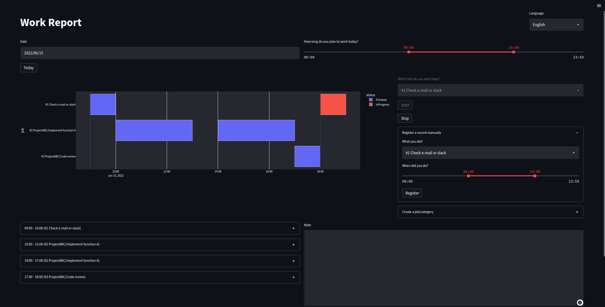

# My Work Tracker

[](https://www.python.org/downloads/)
[](https://streamlit.io/)

A sleek web app built with Streamlit that helps you track your work hours and manage daily tasks. Keep tabs on your daily productivity, organize project activities, and visualize work patterns with interactive charts.

I made this just for fun.😃



## Setup Instructions

### System Requirements

- [uv]: High-performance Python package management tool
- make: Essential build automation utility
- Modern web browser for optimal experience

### Installation Process

```bash
# Set up project dependencies
$ uv sync

# [Optional] Enter virtual environment
$ source .venv/bin/activate
```

### Launch Application

```bash
$ make run

  Access your Streamlit application through your preferred browser.

  Local access: http://localhost:8501
  Network access: http://XXX.XXX.XXX.XXX:8501
```

## Technology Stack

- [streamlit]: Premier framework for rapid data application development and deployment.
- [plotly.py]: Advanced interactive visualization library for creating engaging charts in Python
- [pydantic]: Robust data validation and configuration management with type annotations
- [pony]: Sophisticated object-relational mapping solution for database interactions.

[uv]: https://github.com/astral-sh/uv
[streamlit]: https://github.com/streamlit/streamlit
[plotly.py]: https://github.com/plotly/plotly.py
[pydantic]: https://github.com/samuelcolvin/pydantic
[pony]: https://github.com/ponyorm/pony